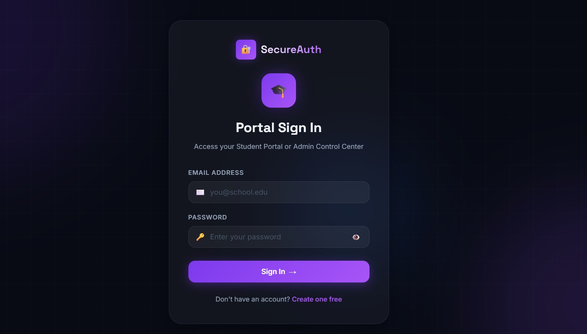
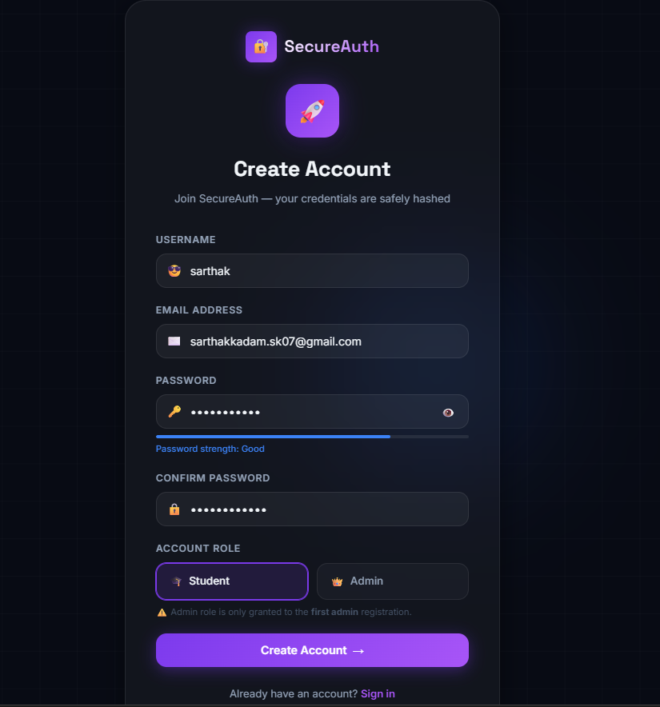
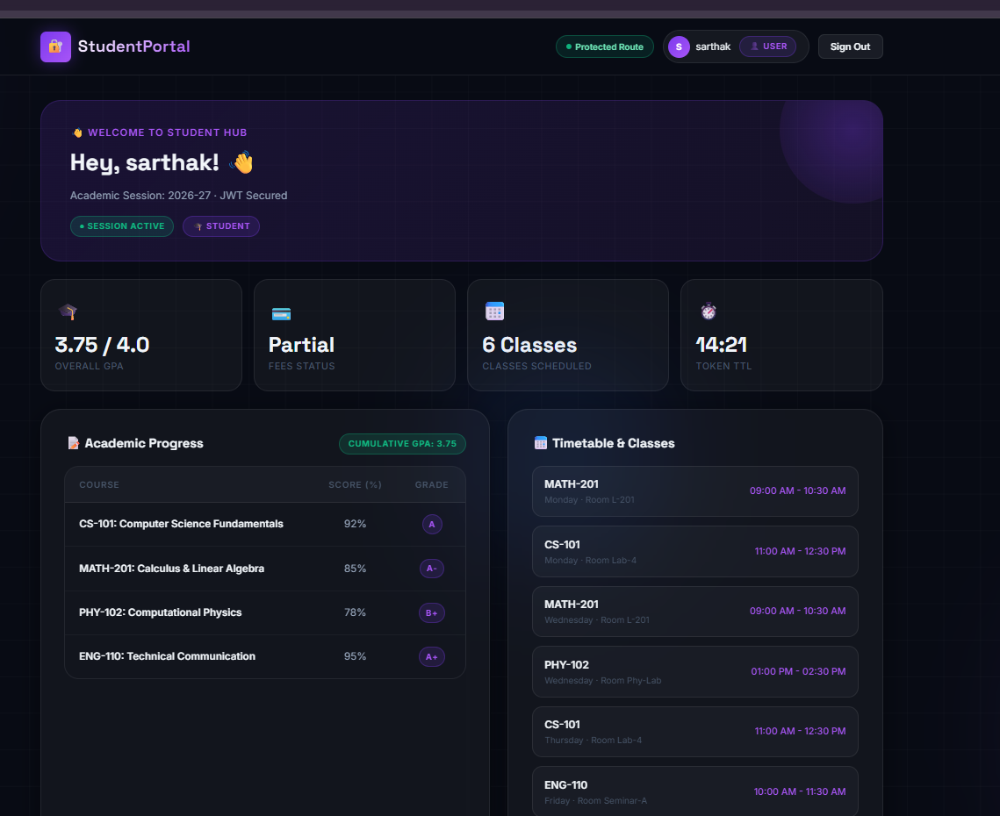
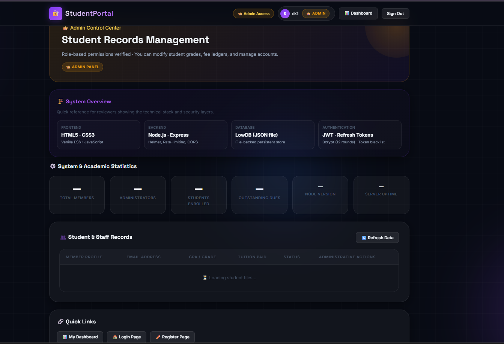
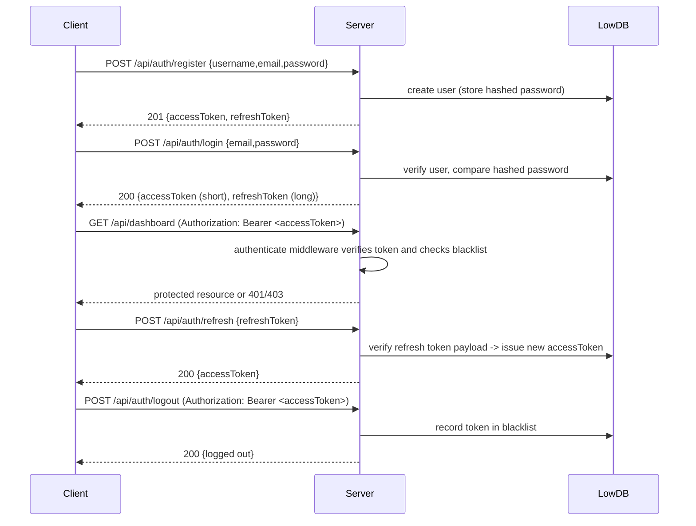

# Secure Authentication & Access Management System

A full-stack authentication project built to understand how modern web applications handle user identity, authorization, and secure access to protected resources.

The project implements user registration, login, JWT-based authentication, role-based access control, password hashing, and security-focused middleware using Node.js and Express.

The goal was not just to create a login form, but to understand the complete authentication workflow used in real applications.

## Project Overview

A compact full‑stack example that demonstrates how to build and secure an authentication system. The project implements:

- user registration and login
- password hashing
- JWT access and refresh tokens
- protected routes and role checks
- explicit token invalidation (logout)

The data store is LowDB (JSON file) for reproducibility and ease of inspection during review.

## Why I Built This Project

I built this project because authentication is a common source of errors and many tutorials stop at a basic form without explaining the design trade offs. I wanted a small, replicable codebase that shows the engineering choices behind secure authentication.

Specifically, I wanted to learn:

- how to properly hash and store passwords,
- how to combine short‑lived access tokens with refresh tokens,
- how to implement logout and token revocation in a clear way, and
- how middleware can separate authentication concerns from authorization checks.

## Features

Authentication

- Register: create account, validate input, store hashed password
- Login: verify credentials, issue access and refresh tokens
- Token refresh endpoint

Authorization

- Protected API endpoints requiring a valid access token
- Role‑based control for admin routes

Security

- Password hashing with `bcryptjs` (12 rounds)
- Rate limiting on authentication routes
- Helmet for secure HTTP headers
- Token blacklist to support explicit logout

User experience

- Minimal frontend for login, registration, dashboard and admin views
- Clear HTTP responses for success and error states
## Screenshots

### Login Page



### Registration Page



### User Dashboard



### Admin Dashboard



## Tech Stack

| Component | Technology |
|-----------|------------|
| Frontend | HTML, CSS, JavaScript (ES6) |
| Server | Node.js, Express.js |
| Auth | JWT (`jsonwebtoken`) |
| Passwords | `bcryptjs` |
| Security | `helmet`, `express-rate-limit`, `cors` |
| Database (demo) | LowDB (file-backed JSON) |

## Architecture Overview

Frontend → Backend API → Authentication layer → LowDB

```mermaid
flowchart LR
    Browser[Browser / Frontend]
    API[Express API]
    Auth[Auth Layer (JWT, middleware)]
    DB[LowDB (data/db.json)]

    Browser -->|POST /api/auth/login| API
    API --> Auth
    Auth --> DB
    Browser -->|GET /api/dashboard (Bearer)| API
    API --> Auth --> DB
```

## Authentication Flow



## Security Considerations (why these choices)

- `bcryptjs` (12 rounds): slows down offline attacks against stored password hashes. The chosen cost is a compromise for a demo environment; production systems must revisit cost based on hardware and latency requirements.

- JWT (access + refresh): access tokens allow the API to be stateless for most requests. Short access lifetimes reduce the window for token misuse; refresh tokens are used to obtain new access tokens while keeping user sessions practical.

- Token blacklist on logout: stateless JWTs cannot be revoked by default. For this single‑process demo, a persisted blacklist enables immediate logout. In distributed systems use a centralized fast store (Redis) and token rotation instead.

- Route protection via middleware: authentication (token verification) is separated from authorization (role checks). This reduces duplicated logic and makes authorization easier to audit.

- Rate limiting: reduces brute force and abusive traffic against authentication endpoints.

- Helmet: applies a set of HTTP headers that mitigate common web vulnerabilities. For local development the demo relaxes strict CSP; production deployments should enable a strict CSP and avoid inline scripts.

- Environment variables: secrets (JWT keys) are read from environment variables. Do not commit these values.

## API Endpoints

| Method | Path | Auth | Purpose |
|--------|------|------|---------|
| POST | `/api/auth/register` | No | Create new user account |
| POST | `/api/auth/login` | No | Authenticate and receive tokens |
| POST | `/api/auth/refresh` | No | Exchange refresh token for access token |
| POST | `/api/auth/logout` | Yes | Invalidate current access token (blacklist) |
| GET  | `/api/auth/me` | Yes | Return current user profile |
| GET  | `/api/dashboard` | Yes | Example protected endpoint (user) |
| GET  | `/api/admin` | Yes (admin) | Example protected endpoint (admin only) |
| GET  | `/api/health` | No | Health check |

See `backend/routes/auth.js` and `backend/routes/protected.js` for request/response examples and validation rules.

## Project Structure

```
SECURITY/
├─ backend/
│  ├─ server.js
│  ├─ routes/
│  │  ├─ auth.js
│  │  └─ protected.js
│  ├─ middleware/
│  │  ├─ auth.js
│  │  └─ roles.js
│  ├─ utils/
│  │  └─ jwt.js
│  ├─ config/
│  │  └─ db.js
│  └─ data/
│     └─ db.json
└─ frontend/
     ├─ index.html
     ├─ register.html
     ├─ dashboard.html
     ├─ admin.html
     └─ js/
            ├─ auth.js
            └─ dashboard.js
```

## Challenges Faced

- Understanding practical token expiry windows and choosing a reasonable TTL for access tokens.
- Implementing logout semantics with JWTs (revocation versus rotation) and deciding on a blacklist approach for clarity in a demo.
- Structuring middleware so authentication and authorization logic are distinct and testable.
- Conveying token-related errors to the frontend in a way that supports reliable client behavior (for example, distinguishing expiry from invalid tokens).

## What I Learned

- How to encapsulate token creation and verification in a small utility (`backend/utils/jwt.js`) so it can be reviewed and tested independently.
- The trade offs between stateless tokens and server‑side revocation and where to apply each approach.
- Why defending authentication endpoints (rate limiting, input size limits, secure headers) matters even in small projects.
- How small API design choices (status codes, consistent error payloads) affect frontend error handling and developer experience.

## Future Improvements

- Migrate data storage to PostgreSQL and add migrations (Prisma or TypeORM).
- Implement refresh token rotation and store refresh tokens in httpOnly, Secure cookies.
- Move token revocation to Redis for multi‑instance deployments.
- Add unit and integration tests for auth flows and middleware.
- Add Dockerfile and a basic CI pipeline for reproducible builds and tests.

## Running Locally

1. Install dependencies and start the backend:

```bash
cd backend
npm install
npm start
```

2. Open the app in a browser: `http://localhost:5000`

Notes:

- Create a `backend/.env` file containing `JWT_SECRET` and `JWT_REFRESH_SECRET` before running. Do not commit these secrets.
- Use `npm run dev` to run with `nodemon` for development.


## Project Highlights

- Implemented JWT-based authentication and authorization
- Designed protected API routes using custom middleware
- Added role-based access control for user and admin access
- Secured credentials using bcrypt password hashing
- Integrated Helmet and Rate Limiting for improved API security
- Built a complete authentication workflow from registration to logout

## Screenshots

- Login page: `frontend/index.html`
- Registration page: `frontend/register.html`
- User dashboard: `frontend/dashboard.html`
- Admin dashboard: `frontend/admin.html`

Add screenshots to `docs/` if you want image references for reviewers.

## Author

Sarthak Kadam

B.Tech Computer Science Student

Interested in full-stack development, backend engineering, and application security.

This project was built as part of my effort to better understand authentication systems, API security, and real-world backend architecture.
